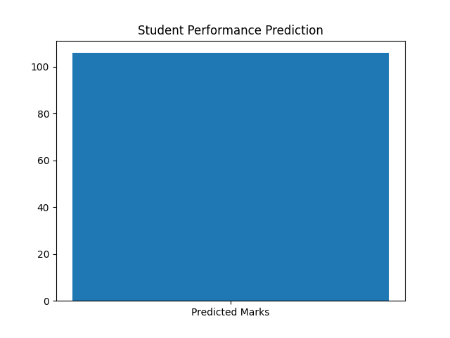

# 🎓 Student Performance Prediction System

## 📌 Overview
This project predicts student performance using Machine Learning. It uses synthetic data and a Random Forest model to estimate final marks.

---

## 🚀 Features
- Synthetic data generation
- Random Forest model
- Model saving & loading (joblib)
- Prediction system
- CSV output
- Visualization chart

---

## 📊 Output Example

---

## 🛠 Tech Stack
- Python
- Pandas
- NumPy
- Scikit-learn
- Matplotlib
- Joblib

---

## ▶️ How to Run
pip install -r requirements.txt  
python main.py  

---

## 💡 Use Case
Helps predict student performance based on study habits and academic data.
